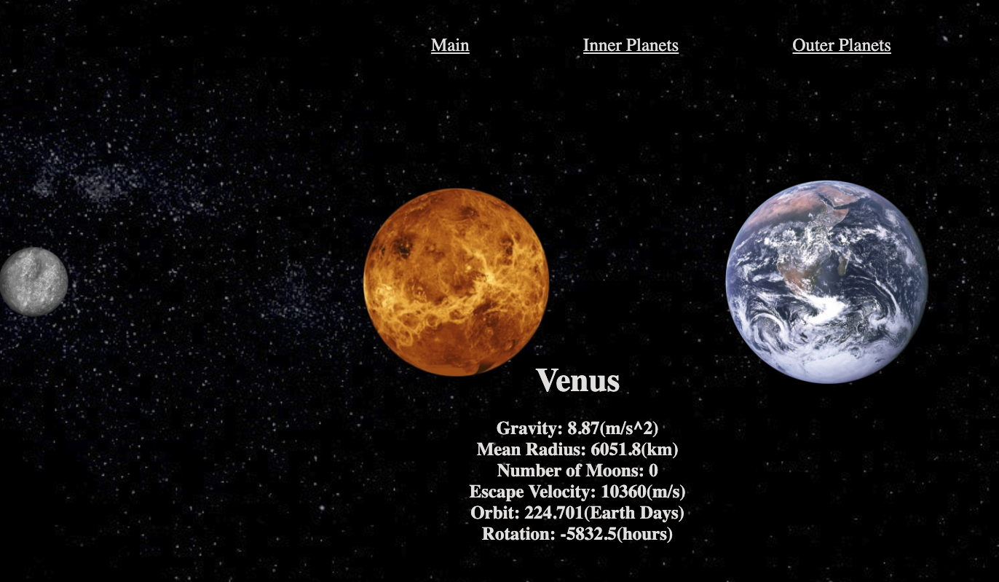

# Tracking Our Universe

## Introduction
The project will display the scaled down version of the solar system. The planets will be to scaled to each other and the sun. The motion of the planets will also be scaled to the actual orbital speed. I have an interest in astronomy and physics and therefore wanted to begin project that will eventually add a simulation of asteroids and their projected paths near Earth, along with the three dimensional representation of the planets.

## Getting Started
The page will load and display the solar system. The user will see the relative orbital speeds of the planets compared to Mercury (as that is the fastes orbiting planet). The user can then select which section of planets they would like more information on. The size of the images are scaled to Jupiter for the outer planets and the inner planets to Mercury.

## API's Used
[Solar System OpenData](https://api.le-systeme-solaire.net/rest/bodies/) - The API will provide the information relating to every object in the solar system.
 
## UPDATES:
[TRELLO](https://trello.com/c/z5hqxade)